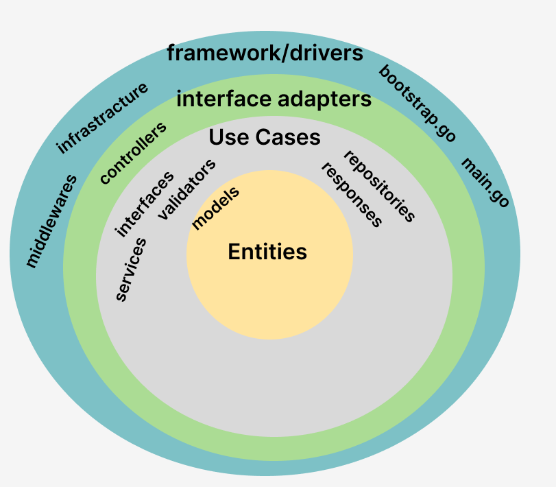

# sternx_challenge

This task involves writing a SQL query to retrieve the latest trade for each symbol from a database schema and creating a microservice with an HTTP API that executes the query and returns the results in JSON format, with an emphasis on code readability and performance optimization.

## Architecture




## Development

To start the task in the run:

```
go run cmd/main.go
```

